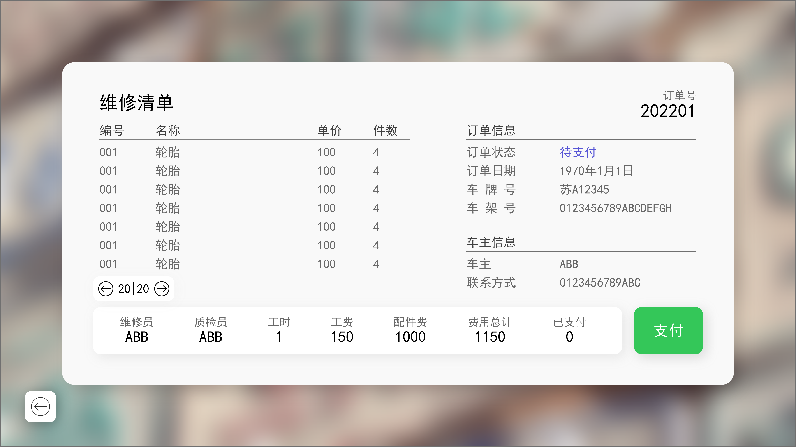

# 专业课程设计II 数据库系统课程设计

> Copyright 2022 HuaCL  
> 2022-2023-1-NJUPT-CS-专业课程设计

> 数据库使用MySQL,候需根据实际情况更改main里面的用户名 
> 建表文件见 DataBase.sql
> 图形界面使用EasyX库，请去官网下载相关库文件，版本20200902

## 课程任务
编程实现一个汽车维修管理系统，要求实现如下功能，编程语言可自选，如Visual C++，C，JAVA等。
1. 车辆管理：实现车辆来访者登记以及车辆管理功能，进行开单操作，同时为维修单分配维修人员和质检人员。
1. 员工任务管理：维修人员登录系统能够看到当前所有的维修任务，进行维修检查，系统需要记录维修人员填写的维修项目、工时和维修材料的申领情况。
1. 维修材料管理：按照维修人员的相关信息和时间范围等条件，查询用户维修用料登记的情况，可以查看每一项登记的领取历史信息，对于材料库存不够的情况，需要进行材料采购的申请。
1. 质检完工：质检员查看自己的质检任务，进行质检，录入质检结果到系统中。
1. 消费结算：车主在约定的时间进行提车，查看维修单，进行付款操作。
1. 配件管理：管理配件的信息，采购相关的配件，录入信息到系统中。
1. 基础数据管理：对系统的一些参数进行配置，管理系统的一些基础数据，个人信息的查看以及密码修改等相关功能。
1. 要求：根据实际情况，自行展开需求分析，完善上述未列出的其他功能；建议用报表的形式完成统计功能。

## 功能实现
根据课题要求和需求分析，本系统主要分为6个模块，分别为：
1.	欢迎界面模块：主要实现用户登录和访客订单查询与访客订单支付；
	1.	输入用户的账号密码，自动判断用户类型并进入相应系统，若密码错误或账号不存在，会提示错误；
	1.	单击访客订单查询，可以查询订单信息。
1.	接待人员模块：主要实现订单的建立、维修员和质检员的分配功能；
	1.	在接待系统主页，可以浏览当前所有的订单信息，也可以分类浏览；
	1.	单击左侧的搜索按钮，可以以订单号进行搜索；
	1.	单击左侧的加号，可以新建订单，输入相应的订单信息并分配维修员和质检员，若信息填写错误（不符合校验规则）会显示红色的叉提示，若信息通过校验规则，会显示绿色的勾；
	1.	全部信息填写完毕，单击添加，系统会将填写的数据存储数据库，并自动获取订单号弹窗提示，同时订单状态设置为“订单创建”并发送给维修员进行维修。
1.	维修人员模块：主要实现查看当前所有的维修任务，对测量进行维修检查并记录工时和配件使用信息，对库存不足的配件要提出申请库存采购功能；
	1.	在接待维修系统主页，可以浏览分配给当前用户的所有的订单信息，也可以分类浏览，只查看待维修订单；
	1.	单击左侧的搜索按钮，可以以订单号进行搜索；
	1.	单击维修，可以填写维修单，单击查看，可以查看订单信息；
	1.	在维修单填写页面中，可以添加需要的配件，若配件有符合数量要求的库存，单击添加即可将此配件的使用记录添加到维修单中；
	1.	若配件没有符合数量要求的库存，可以向库存提出需求；
	1.	单击添加工时，可以添加维修工时，维修单所有信息填写完毕，单击完成，系统将订单状态设置为“等待质检”，发送给相应的质检员进行质检。
1.	质检人员模块：主要实现查看当前所有的质检任务，进行质检，录入质检结果到系统中；
	1.	在质检系统主页，可以浏览分配给当前用户的所有的订单信息，也可以分类浏览，只查看待质检订单；
	1.	单击左侧的搜索按钮，可以以订单号进行搜索；
	1.	单击质检，可以填写质检单，单击查看，可以查看订单信息；
	1.	在质检单填写页面中，可以维修单中添加的各种配件；
	1.	若质检合格，单击通过质检，填写质检描述，系统将订单状态设置为“等待支付”；
	1.	若质检不合格，单击退回维修，填写质检描述，系统将订单状态设置为“质检退回”。
1.	库管人员模块：主要实现查看当前库存状况，管理配件的信息，对采购相关的配件，录入信息到系统中，进行入库操作；
	1.	在库管系统主页，可以浏览所有的库存信息，也可以分类浏览，只查看库存不足的配件；
	1.	单击左侧的搜索按钮，可以以配件名称进行搜索；
	1.	单击修改，可以修改库存信息，进行进库出库操作或删除该配件；
	1.	单击加号，可以添加配件信息，配件信息不应跟现有配件信息相同，若相同，会显示红色的提示。全部信息填写完毕，单击添加，系统会将填写的数据存储数据库。
1.	管理员模块：主要实现对当前系统中的人员进行管理，分配和更改权限，新建用户功能。
	1.	在管理系统主页，可以浏览当前所有的订单信息，也可以分类浏览；
	1.	单击左侧的搜索按钮，可以以订单号进行搜索；
	1.	单击左侧的人员管理安秀，可以对当前系统中的所有用户进行管理；
	1.	单击每一条用户的修改密码或删除按钮，可以更改该用户的密码或删除该用户； 
	1.	在下方填写相应信息，可以新建用户并分配权限，用户名不应跟现有用户名相同，若相同，会显示红色的提示。全部信息填写完毕，单击添加，系统会将该用户信息存储在数据库。

## 界面设计

 
 

 
  
  
  
  
  
  
  
  
 